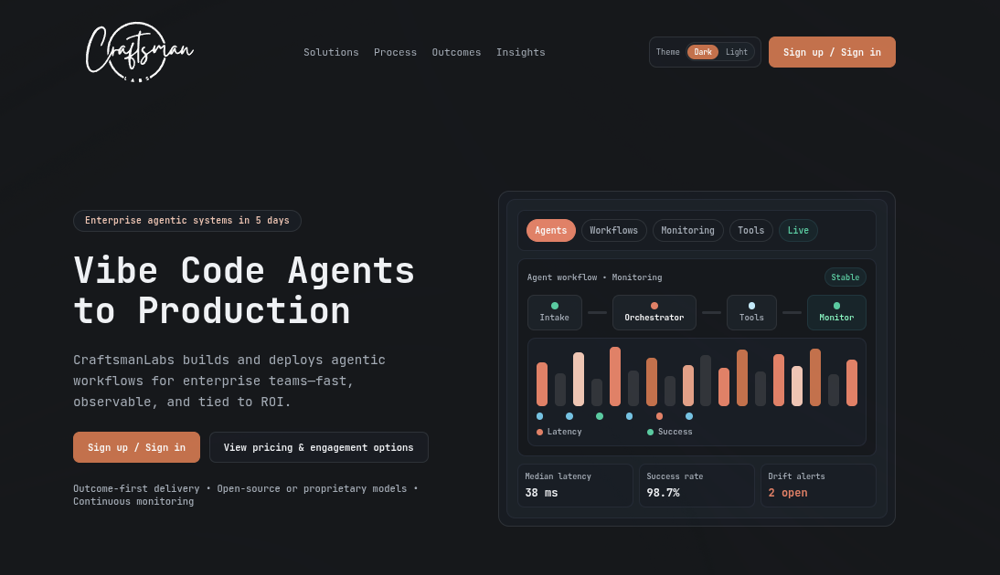

# Hi, I'm Rishub C R aka Craftsman

I build practical AI systems that move from idea to production fast.

- Website: https://www.craftsmanlabs.net/
- Documentation: https://docs.simpleagents.craftsmanlabs.net/

## Rishub C R and CraftsmanLabs

I'm a Chennai-based AI/ML software engineer and indie builder working under the CraftsmanLabs brand. I focus on agentic AI systems, multimodal LLM applications, memory architectures, and production-grade developer tooling.

One-line background: I started shipping and leading technical communities early, then scaled into full-time AI engineering across IDP, NLP, and agent systems.

## Professional snapshot

| Period | Role | Company | Focus |
|---|---|---|---|
| Sep 2024 - Present | Senior AI Engineer, Agentic Builder | CraftsmanLabs | Building production agentic systems, model orchestration stacks, and AI product workflows |
| Feb 2025 - Present | Co-Founder, OS Agentic Builder | Agentics Foundation | OSS non-profit work for advancing practical agentic engineering |
| Jul 2024 - Dec 2025 | SWE ML Engineer | Cato | Built an agentic supply-chain pipeline for inventory/data intake, RFQ entity extraction, supplier routing, invoice draft generation, human-in-the-loop review, and observability traces to improve future accuracy |
| Jul 2023 - Present | Software Engineer ML | Ampliforce | Multimodal LLM systems for intelligent document processing and automation bots |
| Nov 2022 - May 2023 | Solution Engineer | Instabase | Financial document extraction acceleration with LayoutLMv3-based pipelines |
| May 2022 - Jul 2023 | Software Engineer ML | HighIQ.ai | IDP platform development and practical NLP systems |
| 2021 - 2022 | Early engineering roles | FEBA Technologies, Ysquare, HighIQ.ai | Python product engineering and applied NLP research |

- I was a core engineer for this HR-focused project: https://news.microsoft.com/source/asia/features/a-digital-colleague-how-chemist-warehouse-and-insurgence-ai-are-rewriting-the-hr-playbook/

## Why this repository exists

AI is most powerful when we stop treating models as black boxes and start designing systems around them.

I'm exploring the space where:
- human intent defines direction,
- agents execute complex workflows,
- and memory plus orchestration make outputs reliable enough for real-world use.

My focus is simple: **vibe-code agents to production** without giving up control.

That means combining:
- frontier models for capability,
- SLMs for cost and performance on domain tasks,
- and model sovereignty so teams can decide where intelligence runs.

I'm especially interested in building with open and controllable ecosystems, including LFM and Qwen-class models, while keeping interfaces provider-agnostic.

## Flagship projects

| Project | What it does | GitHub |
|---|---|---|
| `SimpleAgents` | Rust-first multi-language framework for building agentic apps with routing, workflows, healing/coercion, caching, and bindings across Rust/Python/Node/Go. | https://github.com/CraftsMan-Labs/SimpleAgents |
| `SimpleMemory` | Rust-first memory service with durable operations, vector search, OpenAPI surfaces, compatibility routes, and MCP tooling for long-context systems. | https://github.com/CraftsMan-Labs/SimpleMemory |
| `SimpleFlow` | Multi-tenant orchestration skeleton (Go + Vue) for agent registration, identity sync, API-key secured chat flows, and streaming-ready architecture. | https://github.com/CraftsMan-Labs/SimpleFlow |
| `SimpleAgentsRLM` | Recursive Language Model implementation showing how to keep context external and reason with executable recursive steps. | https://github.com/CraftsMan-Labs/SimpleAgentsRLM |
| `LitellmProxy` | Unified LiteLLM proxy layer for multi-provider model access (Azure, Gemini, DeepSeek, Ollama, and more) behind one interface. | https://github.com/CraftsMan-Labs/LitellmProxy |
| `ImageToAgent` | Converts whiteboard-style workflow sketches into runnable chat and agent application flows. | https://github.com/CraftsMan-Labs/ImageToAgent |

## Packages I've developed

These packages are published and available to use today.

| Package | Registry | Link |
|---|---|---|
| `simple-agents-py` | PyPI | https://pypi.org/project/simple-agents-py/ |
| `simple-agents-node` | npm | https://www.npmjs.com/package/simple-agents-node |
| `simple-agent-type` | crates.io | https://crates.io/crates/simple-agent-type |
| `simple-agents-cache` | crates.io | https://crates.io/crates/simple-agents-cache |
| `simple-agents-core` | crates.io | https://crates.io/crates/simple-agents-core |
| `simple-agents-ffi` | crates.io | https://crates.io/crates/simple-agents-ffi |
| `simple-agents-healing` | crates.io | https://crates.io/crates/simple-agents-healing |

## Documentation and package stats

| Package | Version | Downloads |
|---|---|---|
| `simple-agents-py` |  |  |
| `simple-agents-node` |  |  |
| `simple-agent-type` |  |  |
| `simple-agents-cache` |  |  |
| `simple-agents-core` |  |  |
| `simple-agents-ffi` |  |  |
| `simple-agents-healing` |  |  |

## Tech stack

| Category | Technologies |
|---|---|
| Core languages | Rust, Python, JavaScript, SQL |
| LLM and AI frameworks | LiteLLM, DSPy, Pydantic, LangFlow, LionAGI |
| Model families | GPT, Claude, Mistral, LLaVA, Donut, Qwen, LFM |
| Computer vision and document AI | OpenCV, LayoutLMv3, Inception-ResNet |
| Vector and memory systems | Pinecone, Qdrant |
| Inference and serving | vLLM, MLX, Triton Inference Server |
| Cloud and infra | GCP, Azure, Docker |
| UI and product surfaces | Open WebUI, LibreChat, Gradio |

## Technical writing and research themes

- AI architecture blueprints for enterprise systems and agent platforms
- RL and reasoning methods for LLM workflows (including GRPO and recursive approaches)
- Multi-agent collaboration patterns with sparse communication and tool routing
- RAG preprocessing and context-optimization strategies for better retrieval quality
- Applied AI pipelines in finance, supply chain, healthcare, and scientific discovery

## Open-source engagement

I actively build, fork, and contribute around the agentic ecosystem, including infrastructure, model serving, MCP-based tooling, and production workflow patterns.

## Online presence

| Platform | Link |
|---|---|
| Website | https://www.craftsmanlabs.net/ |
| GitHub | https://github.com/CraftsMan-Labs |
| LinkedIn | https://www.linkedin.com/in/rishub-c-r |
| Linktree | https://linktr.ee/CraftsmanLabs |

## Let's collaborate

If you're building in agent orchestration, memory systems, model routing/proxy layers, or domain-specific AI products, I'd love to collaborate.

Open an issue, start a discussion, or reach out through any repo above.
